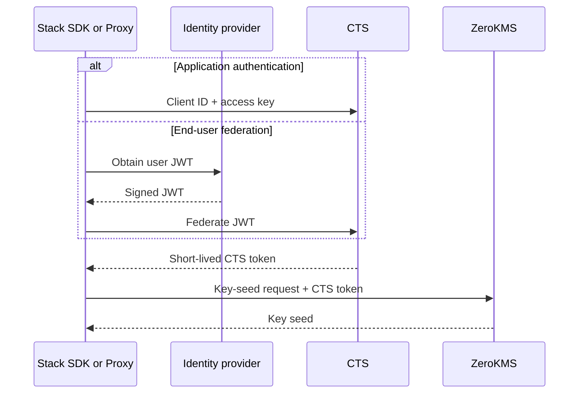

CipherStash Token Service (CTS) is the authentication and identity-federation
layer in front of ZeroKMS. It converts a persistent application credential or
a trusted identity-provider token into a short-lived token scoped to
cryptographic service access.

CTS plays a role similar to AWS STS: the long-lived credential proves who the
caller is, while the issued token is temporary and is what the caller presents
to ZeroKMS.

## Request flow

The Stack SDK refreshes service tokens as required. Application code normally
selects an auth strategy rather than calling CTS directly.

## Authentication modes

### Application credentials

A production service or Proxy instance uses a
[client key](/reference/auth/clients) and
[access key](/reference/auth/access-keys). This authenticates the workload as
an application rather than as a particular end user.

### OIDC federation

Register a trusted issuer and use `OidcFederationStrategy` when each request
should carry the signed-in user's identity. CTS validates the provider JWT and
issues the temporary service token. See
[OIDC providers](/reference/auth/oidc-configuration).

Federated identity can also be used with a lock context so key derivation
depends on a JWT claim. That cryptographic binding is described in
[provable access control](/solutions/provable-access).
