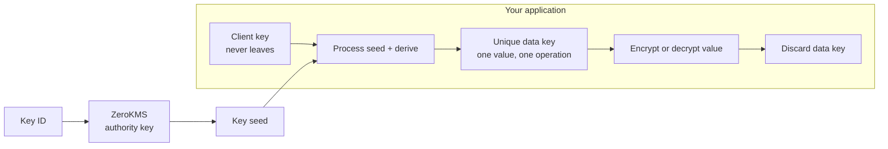

Encryption is only as strong as the system that controls its keys. If an application keeps one long-lived key beside the data it protects, encrypting the database changes its appearance without meaningfully changing who can unlock it.

ZeroKMS takes a different approach. Every encrypted value gets a unique data key. No data key is stored, transmitted, or reused, and neither CipherStash nor your application holds enough long-lived material to derive one alone.

This gives CipherStash three properties that are difficult to combine with conventional key management:

- **Fine-grained protection:** compromising one derived data key exposes one value, not a table or batch.
- **Split control:** CipherStash holds one side of the key relationship and your application holds the other. Neither side is sufficient by itself.
- **Production performance:** bulk operations derive unique keys locally after one ZeroKMS interaction instead of making one network request per value.

## The problem with conventional envelope encryption

Cloud key-management services commonly use envelope encryption. The KMS generates a data encryption key, returns the plaintext key to the application, and returns a second copy wrapped by a root key. The application encrypts the data, discards the plaintext key, and stores the wrapped key beside the ciphertext.

On read, the application sends the wrapped key back to the KMS and receives the plaintext data key again.

That works well for individual objects. It becomes difficult at database scale. A result containing 100 rows with two independently encrypted fields needs 200 data keys. Using one unique key per value means hundreds of KMS requests; reusing and caching a key makes the application faster but expands the amount of data that key can decrypt.

Caching also weakens observability. Once one cached key unlocks thousands of values, the key service can record that the key was used but cannot tell which individual value the application accessed.

The usual design therefore trades among:

- how much data one key can decrypt;
- how many network calls an operation can tolerate; and
- how precisely key use can be audited.

ZeroKMS is designed to remove that tradeoff.

## The ZeroKMS mental model

A usable data key is never handed from one system to another. It comes into existence only inside your application, when material from ZeroKMS is processed with material that never leaves your environment.

Four pieces have distinct jobs:

| Material | Where it exists | What it can do alone |
|---|---|---|
| **Authority key** | ZeroKMS, encrypted at rest under an AWS KMS root key | Produce a key seed; it cannot derive your data keys without the client key |
| **Client key** | Your application environment | Process a key seed; it cannot derive a data key without ZeroKMS |
| **Key seed** | Returned by ZeroKMS for a key ID and held for the operation | Nothing useful without the client key |
| **Data key** | Your application's memory for one operation | Encrypt or decrypt one value; then it is discarded |

The authority key and client key form a split. They are never brought together. ZeroKMS never receives the client key, and your application never receives the authority key.

CipherStash uses proxy symmetric re-encryption to produce the seed on the ZeroKMS side. The application then processes that seed with its client key and uses an HMAC-based key derivation function to produce the data key. [Cryptography](/security/cryptography) is the canonical technical description of both layers.

## A unique key for every value

Each encrypted value carries a key ID. That ID is not secret and is not key material; it tells ZeroKMS which reproducible seed the client needs for that value.

### Encrypt

1. The client creates a new key ID.
2. ZeroKMS authorizes the request and produces the corresponding key seed.
3. The application processes the seed with its client key and derives a unique data key.
4. The data key encrypts one value, then is discarded.
5. The key ID travels with the ciphertext. The data key does not.

### Decrypt

1. The client reads the key ID from the encrypted payload.
2. ZeroKMS authorizes a request for that ID and reproduces the same seed.
3. The application processes it with the client key and derives the same data key.
4. The value is decrypted and the data key is discarded again.

There is no database of per-value data keys to protect or restore. The persistent state is the much smaller authority/client relationship from which a data key can be reproduced only when both sides participate.

## Why split control changes application compromise

A compromised application is serious, but it is not equivalent to losing a permanent master key.

**The client key is insufficient on its own.** Stealing it does not let an attacker derive historical data keys offline. The encrypted payload contains a key ID, not a seed or wrapped data key. ZeroKMS must still authorize and participate in each derivation.

**There is no cache of reusable data keys to steal.** A data key exists only while one value is being processed. Capturing it does not unlock the next row.

**Access has a server-side off switch.** Revoking a client's access key or its grant to a keyset prevents future seed requests. Because the decision is made during derivation, revocation does not depend on a compromised process voluntarily honoring a new policy.

**The blast radius is scoped.** A client can derive keys only for the keysets it has been granted. Separate keysets create cryptographic boundaries between tenants, environments, regions, or workloads.

**Identity can narrow it further.** A lock context can bind derivation to a claim from an authenticated end user. Possessing the service's client key is then not enough to decrypt a value locked to a different identity. See [Provable access control](/solutions/provable-access).

**Derivation is observed outside the application.** ZeroKMS records the operation before returning the material required for decryption. An attacker operating only inside the application cannot edit or suppress that service-side record in the way they could alter application logs.

An attacker controlling a live, authorized process may still request the operations available to that process while access remains valid. The important difference is that the capability is **scoped, observable, and revocable**—not a reusable master key that can be copied once and used forever offline.

## Keysets define the isolation boundary

A keyset is an independent authority-key scope. The same key ID under two keysets produces unrelated data keys, so ciphertext created under one keyset cannot be decrypted through another.

Common boundaries include:

- one keyset per customer in a multi-tenant application;
- separate keysets for development, staging, and production;
- regional keysets for data-residency requirements; and
- separate keysets for business units or workloads with different operators.

Client access is granted per keyset. Revoking that grant stops the client from deriving any more keys in that boundary without changing database permissions or rewriting the ciphertext.

Keyset design also controls intentional correlation. Encrypted equality and joins work only across compatible values under the same cryptographic scope; separating keysets prevents both decryption and cross-boundary encrypted comparison.

The default workspace keyset is sufficient for many applications. Add more when your security boundary is narrower than the workspace.

## Bulk performance without data-key caching

The data-key-per-value model would be impractical if every value needed an independent network and HSM round trip.

ZeroKMS batches the server-side work. A bulk operation can obtain the seed material it needs in one interaction, then derive each value's unique data key locally. Increasing a batch from ten values to a thousand increases local cryptographic work, but does not turn into a thousand sequential requests to the key service.

This is why the Stack SDK's bulk operations are both the performance path and the strongest key-granularity path. They do not improve throughput by reusing a data key.

<Callout type="info">
No **data key** is cached. CipherStash Proxy does cache bounded, keyset-scoped cipher objects so it does not reinitialize them for every statement. Those objects still require the client side of the split, and every value still receives its own derived data key. See [what is cached](/security/cryptography#what-is-cached-and-what-is-not).
</Callout>

## Authorization and audit are part of derivation

With a policy check in application code, authorization happens first and decryption happens later. A bug or compromised process can create a gap between the decision and the use of the key.

ZeroKMS evaluates authorization while producing the key seed. The authorization decision and the cryptographic operation are therefore part of the same event: if ZeroKMS does not authorize the request, the application does not receive the material required to derive the data key.

That event also creates an independent audit record. Depending on how the client authenticated, it can identify the service or federated end user, the keyset, the operation, and the time. Lock contexts add the identity claim bound to the value.

This is more useful than a log that says a SQL query ran. It records the operation that made plaintext recovery possible, at the system that had to participate in it.

## What is stored

The design deliberately keeps the durable pieces small and separated:

| Location | Stored |
|---|---|
| Your database | Ciphertext, key ID, and any searchable index terms |
| Your application environment | Client key and credentials used to authenticate to ZeroKMS |
| ZeroKMS | Authority keys and access-control state |
| Nowhere | Plaintext data keys |

Your encrypted data stays in your database. ZeroKMS handles key material, not application data. This separation also shapes recovery: restoring ZeroKMS restores the ability to reproduce keys; it does not require CipherStash to restore or move your encrypted database. See [Disaster recovery](/stack/cipherstash/kms/disaster-recovery).

## ZeroKMS and searchable encryption

ZeroKMS protects the keys used by the [Stack SDK](/reference/stack) and [CipherStash Proxy](/reference/proxy). Searchable encryption adds purpose-built terms so PostgreSQL can locate ciphertext without those keys.

The responsibilities remain separate:

- ZeroKMS participates in encryption and decryption key derivation.
- The client creates ciphertext and searchable terms in your environment.
- PostgreSQL compares terms but cannot derive a data key or decrypt a result.

Start with [Searchable encryption](/concepts/searchable-encryption) for the query model. Continue to [Cryptography](/security/cryptography) for algorithms, trust boundaries, and the precise data flow.
