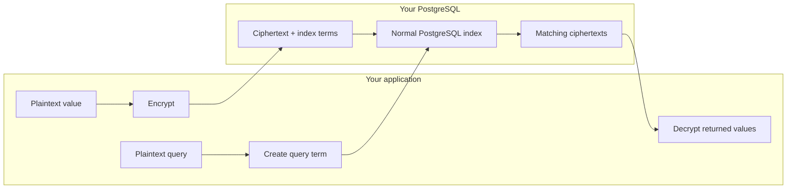

Searchable encryption lets you encrypt sensitive data before it reaches PostgreSQL **without giving up the queries your application depends on**.

Your application can still look up a customer by email, order transactions by date, filter records by a range, match text, and query structured JSON. PostgreSQL answers those queries using encrypted indexes. It never receives the plaintext or the keys that decrypt it.

That changes field-level encryption from an archival control into something you can use on live application data.

## What searchable encryption makes possible

**A database breach yields ciphertext.** Backups, replicas, database consoles, and direct SQL access no longer expose the protected fields. Encryption happens in your application, outside the database trust boundary.

**Your product keeps working.** `WHERE`, ranges, ordering, grouping, joins, fuzzy text matching, and JSON containment remain available. Existing PostgreSQL indexes continue to do the heavy lifting.

**Search does not grant decryption.** PostgreSQL can find matching rows but returns ciphertext. Decryption is a separate operation performed by an authorized application, and can be bound to an end-user identity with [provable access control](/solutions/provable-access).

**You decrypt less data.** The database narrows millions of encrypted rows to the small result set the application asked for. Only those returned values need to be decrypted.

**Sensitive access becomes auditable.** Every decryption requires key derivation through ZeroKMS. When the client authenticates as the end user, the audit trail records whose identity authorized that operation—not merely which SQL statement ran.

These properties are especially useful for applications and AI agents that need to locate sensitive records without receiving blanket access to every value in the table.

## Why ordinary encryption breaks queries

Modern authenticated encryption is randomized. Encrypting `ava@example.com` twice produces different ciphertexts, even with the same key. This prevents an observer from recognizing repeated plaintext, but it also means ordinary database operations stop working:

```sql
WHERE email = 'ava@example.com'
ORDER BY date_of_birth
WHERE name LIKE '%martin%'
```

Two ciphertexts cannot be compared for plaintext equality, and sorting random-looking bytes does not sort the underlying values. Decrypting every row inside PostgreSQL would expose the plaintext and turn an indexed lookup into a full-table scan.

Searchable encryption solves this by separating **the value** from **the information needed to query it**.

## How CipherStash makes an encrypted column searchable

CipherStash stores a randomized ciphertext together with one or more encrypted index terms. Each term has one job: equality, ordering, text matching, or structured JSON search.

For an email column that supports equality, the stored value is conceptually:

```json
{
  "ciphertext": "randomized encryption of ava@example.com",
  "equalityTerm": "keyed deterministic term"
}
```

The real [EQL payload](/reference/eql/core-concepts#anatomy-of-an-encrypted-value) also carries the metadata needed to validate and decrypt it. PostgreSQL never compares the randomized ciphertext. It extracts and compares the purpose-built term.



### Write path

1. The Stack SDK or CipherStash Proxy receives a plaintext value in your application environment.
2. It encrypts the value with a unique data key and creates the terms declared for that column.
3. Your application sends the encrypted payload to PostgreSQL.
4. PostgreSQL stores the payload and indexes its terms. It never sees the plaintext or data key.

### Query path

1. The application turns the plaintext query operand into a term using the same cryptographic scope as the column.
2. It sends that term as a bound query parameter.
3. [EQL](/reference/eql) routes the comparison to the matching term, and PostgreSQL uses the appropriate functional index.
4. PostgreSQL returns only the matching ciphertexts.

### Read path

1. The application passes a returned payload to the SDK or Proxy.
2. ZeroKMS authorizes the key derivation and returns the material the client needs.
3. The client derives the data key locally, decrypts the value, and discards the key.

Search and decryption are deliberately separate. PostgreSQL can find records, but it cannot decrypt them.

## A concrete equality lookup

The column's EQL type declares its capability. An equality-searchable email uses `public.eql_v3_text_eq`:

```sql filename="schema.sql"
CREATE TABLE users (
  id BIGINT GENERATED ALWAYS AS IDENTITY PRIMARY KEY,
  email public.eql_v3_text_eq
);

CREATE INDEX users_email_eq
  ON users USING hash (eql_v3.eq_term(email));
```

The application encrypts both stored values and query operands:

```typescript filename="lookup.ts"
const term = await encryptionClient.encryptQuery("ava@example.com", {
  column: users.email,
  table: users,
})

if (term.failure) {
  throw new Error(term.failure.message)
}

const rows = await db.query(
  "SELECT id, email FROM users WHERE email = $1::jsonb::eql_v3.query_text_eq",
  [term.data],
)
```

PostgreSQL uses `users_email_eq` to locate the matching term. The result still contains an encrypted email; the application calls `decrypt` only if it is authorized to reveal it. The [Quickstart](/get-started/quickstart) walks through the complete setup.

## Query capabilities

You select capabilities per column, so a lookup field does not need to carry the machinery for range or text search.

| Capability | What it enables | Typical uses | EQL term |
|---|---|---|---|
| Storage only | Store and decrypt | Secrets or fields never filtered in SQL | None |
| Equality | `=`, `<>`, `IN`, grouping, uniqueness, equijoins | Email lookup, customer IDs, external references | Keyed HMAC (`hm`) |
| Ordering and range | Equality, `<`, `>`, `BETWEEN`, `ORDER BY`, `MIN`, `MAX` | Dates, amounts, scores, measurements | OPE (`op`) or block ORE (`ob`) |
| Free-text match | Probabilistic n-gram matching with `@@` | Names, descriptions, addresses | Encrypted Bloom filter (`bf`) |
| Searchable JSON | Path access, exact containment, ordered leaf comparisons | Flexible metadata and nested application records | Deterministic selectors and ordered leaf terms |

EQL exposes these as concrete domain variants such as `text_eq`, `integer_ord`, and `text_match`. Your ORM integration maps its encrypted column types to the same model. See [EQL core concepts](/reference/eql/core-concepts#variants-declare-capability) for the full matrix.

## It still uses PostgreSQL indexes

Searchable encryption is practical because the encrypted terms fit PostgreSQL's existing index machinery:

- hash or B-tree indexes serve exact matching;
- B-tree indexes serve ranges and ordering;
- GIN indexes serve encrypted text matching and JSON containment.

PostgreSQL does not scan and decrypt the table. Once the query operand has been converted to a term, the query follows the same broad execution shape as an indexed plaintext query.

In CipherStash's reference benchmarks at one million rows, exact matching and OPE range queries both run at about **0.12 ms**, within **1.2–1.4×** of equivalent plaintext PostgreSQL queries. Free-text matching is **100–400× faster** with its GIN index than with a sequential scan. Hardware and workloads vary; [Benchmarks](/reference/benchmarks) contains the environment, query plans, and reproducible suite.

## Search and access control reinforce each other

Database access and plaintext access are different permissions:

| Operation | Where it happens | What is required |
|---|---|---|
| Find matching rows | PostgreSQL | Encrypted query term and the matching EQL operator |
| Read stored values | PostgreSQL | Database permission; the result is ciphertext |
| Reveal plaintext | Your application | Client key plus an authorized ZeroKMS derivation |

With [provable access control](/solutions/provable-access), decryption can also require the signed-in user's identity. An application or agent can query a shared encrypted dataset, receive candidate rows, and decrypt only the values that identity is permitted to access. ZeroKMS records the derivation that made each decryption possible.

Searchable encryption is what makes that model usable: applications can locate the right protected records before asking to reveal them.

## Choosing capabilities

Start from the behavior your product needs:

- Use equality for identifiers and lookup fields.
- Use ordering for values that must support ranges or sorting.
- Use free-text match for human-entered text where token matching is useful.
- Use searchable JSON when flexible document structure is part of the data model.
- Use storage-only encryption when the application reads a field by some other key and never filters on it.

The narrower type is often also the clearest schema. A `text_eq` column tells future maintainers that it is a lookup field; a `text_match` column says it supports token matching but not sorting. Unsupported operations fail rather than silently returning an incorrect result.

## The security tradeoff

The database needs some information to answer a query. Searchable terms expose defined relationships between encrypted values while keeping the values themselves secret. The capability you select determines that relationship:

| Capability | What a database observer can infer |
|---|---|
| Storage only | Table shape, row count, nullness, update timing, and approximate value size—but no equality or ordering term |
| Equality | Which comparable values are equal, and therefore their frequency |
| Ordering | Equality, frequency, and the relative order of values |
| Free-text match | Probabilistic token overlap, repeated token sets, and approximate token-set size |
| Searchable JSON | Repeated paths and structures, equality of path/value pairs, document shape, and ordering of searchable leaves |

The terms are keyed. Someone who steals an equality term cannot hash a plaintext dictionary and compare it without the key. However, frequency distributions, known records, and other auxiliary information can still make likely values easier to infer—particularly in small or predictable domains.

Queries add their own observable patterns. A database operator can see repeated searches, which rows match, and where range boundaries fall. This is known as search-pattern and access-pattern leakage. The database still does not receive the plaintext query, but logs, endpoint behavior, or known test records can sometimes label an otherwise encrypted term.

This is why capabilities are selected per column instead of enabled globally. If relative order is sensitive but exact lookup is acceptable, choose equality rather than ordering. If even equality groups are sensitive, use storage-only encryption and filter a smaller candidate set after decryption in the application.

For the application and key-management trust boundary, see [Cryptography](/security/cryptography). For the exact payload fields and EQL operators behind each capability, see [EQL core concepts](/reference/eql/core-concepts).
