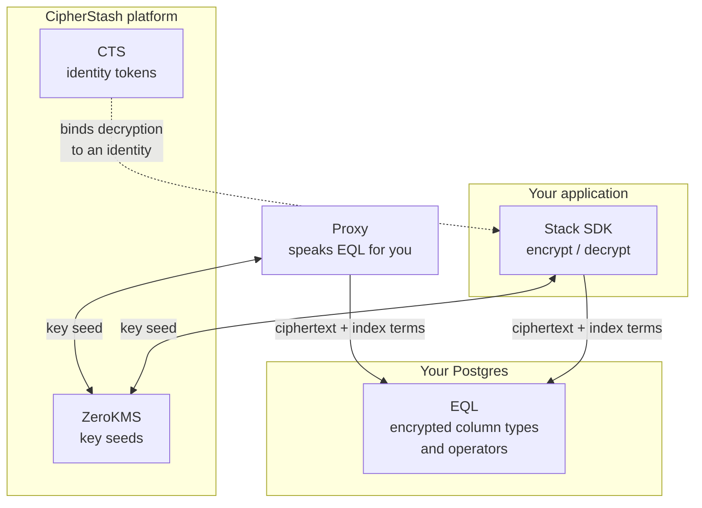

CipherStash encrypts individual fields in your application, before they reach the database, and keeps them queryable in Postgres. The database stores ciphertext and can still answer `WHERE`, `ORDER BY`, and containment queries against it.

A breach yields ciphertext. So does a compromised agent, an over-permissioned service, and a curious insider.

## The problem

Encrypting a column has always meant losing the query. So teams encrypt at rest, which protects the disk and nothing else: the moment a query runs, the database has plaintext, and so does anyone who reached the database.

That was tolerable when the thing reading your data was a person. It is less so now that it is an agent running on application credentials, at machine speed, one prompt injection away from exfiltration.

## The mental model

Three ideas carry the whole product.

**Encryption happens in your process.** Not in the database, not on our infrastructure. Plaintext never leaves your application.

**Every value gets its own key.** Not a table key or a column key. A per-value key, derived for one operation and discarded. Compromising one value tells an attacker nothing about the next.

**Ciphertext stays queryable.** Alongside each encrypted value, the client stores index terms that let Postgres compare ciphertext without decrypting it. This is the trade at the heart of the product, and it is not free: see [what the terms reveal](#the-trade).

## The pieces

| Piece | What it does | When you need it |
|---|---|---|
| [Stack SDK](/reference/stack) | Encrypts and decrypts values in your application | The default path. Start here. |
| [EQL](/reference/eql) | The Postgres surface: encrypted column types, operators, and term extractors | Always, if the data lives in Postgres. Installed once per database. |
| [Proxy](/reference/proxy) | Sits in front of Postgres and speaks EQL for you | When you cannot change the application |
| ZeroKMS | Returns a key seed per value; never sees your client key or a data key | Always. See [cryptography](/security/cryptography). |
| CTS | Federates your identity provider so decryption can be bound to a user | Only for [identity-aware encryption](/solutions/provable-access) |

You rarely need all of them at once. The Stack SDK plus EQL is the common case. Proxy is the alternative to the SDK, not an addition to it.

Note that **EQL is only for Postgres**. The SDK also encrypts values that never touch a database, and non-Postgres stores like [DynamoDB](/stack/cipherstash/encryption/dynamodb), with no EQL involved.

## The trade

Querying ciphertext is possible because each value carries index terms derived from the plaintext. Those terms are not the plaintext, but they are not nothing either.

An equality term reveals which rows share a value. An ordering term reveals relative order. A free-text term reveals probabilistic token overlap. That is the price of a `WHERE` clause, and whether it is worth paying depends on the column.

The honest version of this, per term, is in [searchable encryption](/concepts/searchable-encryption). Read it before deciding a column is safe to index. Columns you only store and retrieve can carry no terms at all.

## Which door

**You are building.** Start with the [Quickstart](/get-started/quickstart), then [choose your stack](/get-started/choose-your-stack) to find the integration that matches your platform and ORM.

**You are evaluating.** [Architecture & security](/security) is self-contained for a vendor review, starting with [cryptography](/security/cryptography). [Solutions](/solutions) covers the problems teams bring us.

**You are deciding whether this is the right tool.** [Concepts](/concepts) explains how it works and where it does not apply. The [comparisons](/concepts/compare) are written to be honest about what CipherStash is not.

## Performance

Encryption in use is usually assumed to be slow. It is, if you do it with fully homomorphic encryption. Searchable encryption is a different trade: bounded, published leakage in exchange for the database doing ordinary index work on ciphertext.

| | |
|---|---|
| Query overhead | Sub-millisecond. The encrypted operators inline into functional indexes, so Postgres does a normal index scan. |
| vs fully homomorphic encryption | [410,000x faster](https://github.com/cipherstash/tfhe-ore-bench) on the per-row primitives a database actually executes. |
| vs AWS KMS | Up to 14x the throughput, because ZeroKMS derives keys in bulk rather than one call per value. |

The FHE comparison is an open benchmark harness you can run yourself. See [CipherStash vs FHE](/stack/reference/comparisons/fhe) for the methodology, and for the workloads where FHE is genuinely the right tool.

## What it protects against

| Threat | What happens |
|---|---|
| Database breach | Ciphertext. The keys were never in the database. |
| Compromised application credentials | Ciphertext, unless the attacker also holds the client key. |
| AI agent exfiltration | The agent reaches the database and decrypts nothing, because its credentials are not the user's keys. |
| Curious insider | Every decryption is a key derivation, and ZeroKMS records who performed it. |

What it does **not** protect against: an attacker who has compromised your running application process, holding the client key and able to call `decrypt`. Encryption in the application means the application can decrypt. See [cryptography](/security/cryptography) for the full trust model.
