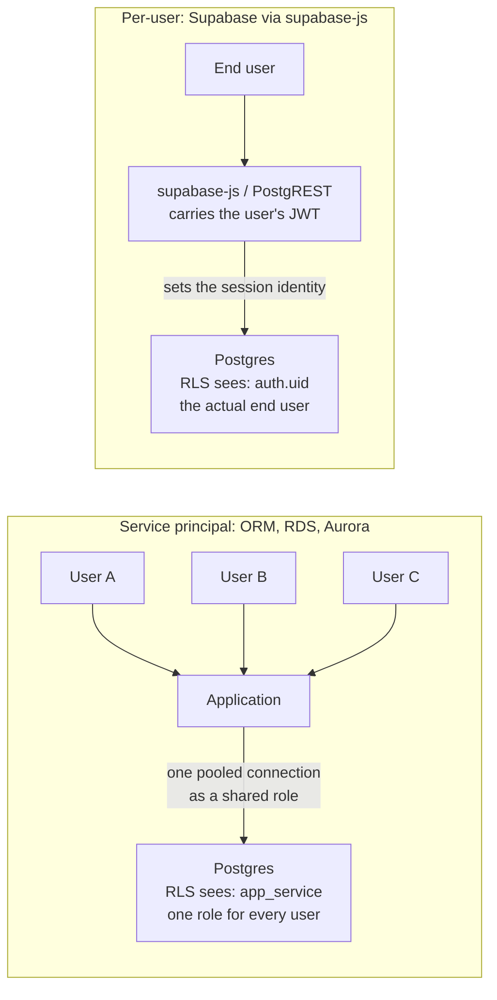

Row-Level Security (RLS) and Transparent Data Encryption (TDE) are the two controls most teams already have when they start protecting sensitive data in Postgres. Both are useful. Neither does what CipherStash does, and CipherStash does not replace either. This page draws the lines: what each control protects, what it leaves exposed, and how the three fit together.

Start with the one fact that surprises people most: **RLS enforces rules against the identity of the database connection, and your application almost never connects as the end user.** That single detail decides where RLS can protect you, and in the most common ways applications talk to Postgres, the answer is that it cannot. The rest of this page builds on that.

## Row-Level Security enforces on the connection, not the user

Row-Level Security is authorization, not encryption. A policy attaches a predicate to a table so that a role only sees, or only modifies, the rows that match. It is the standard tool for multi-tenant isolation and per-user visibility, and where it is wired up it works well.

The catch is what "role" means. RLS policies are evaluated against the identity of the **database session**: the Postgres role you connected as, plus whatever you have set in that session. They know nothing about the *end user* of your application unless you put that user's identity into the session yourself, on every request.

Almost no application does. The standard pattern is a **service principal**: the app opens a pool of connections as one shared database role and reuses them across every request and every user. Under that model `current_user` is identical for all of them, so a policy keyed on the end user has nothing to distinguish them by. RLS is not switched off; it simply has no per-user signal to act on.

To make RLS enforce per-user rules, you have to get the end user's identity into the session on each request, by one of:

- a distinct database role per end user, which does not survive connection pooling and does not scale; or
- a per-transaction session variable (`SET LOCAL app.user_id = ...`) that your policies read with `current_setting(...)`. This is real plumbing that every query path has to honor, and a single direct connection or a forgotten `SET` silently bypasses it.

### Where it works, and where it doesn't

On the left, three end users share one pooled connection, so the database only ever sees the service-principal role and RLS cannot tell them apart. On the right, the data API carries each user's identity into the session, so RLS can act on it.

The one place per-user RLS is wired up for you is a data API that carries the end user's token into the database session. **Supabase** does this through **supabase-js** and the PostgREST data API behind it: the user's JWT sets the session role and claims, so a policy can call `auth.uid()` and mean it.

Connect to that same database a different way and the context is gone:

- **Drizzle, Prisma, or any ORM or driver** connects over a direct Postgres connection as the **service principal**. There is no end-user JWT and no per-user session context, so RLS is back to seeing one shared role.
- **AWS RDS, Aurora, Cloud SQL, and self-managed Postgres** have no equivalent of the Supabase data API. Every connection is a service principal unless you build and enforce the session-context propagation yourself.

So for the most common way applications actually reach Postgres, an ORM over a pooled service-principal connection, per-user RLS is not available by default. It is powerful where it is wired up, and absent almost everywhere else. That gap is worth naming before you rely on it.

## Transparent Data Encryption protects the disk, not the query

Transparent Data Encryption encrypts the database's data files on disk. The database decrypts pages as it reads them, so from the perspective of any SQL query the data is plaintext. That transparency is the feature and the limit at once.

TDE closes exactly one threat: someone walks off with the **physical media**, a decommissioned drive, or a raw backup file, and tries to read it outside the running database. Against that, it works well.

It does nothing about the threats that account for most real exposure, because every one of them goes through the running database, where data is already decrypted:

- A DBA, a compromised application, or a SQL-injection payload reads the tables directly.
- A logical replica, a read replica, or a change-data-capture stream carries plaintext downstream.
- Query logs, `EXPLAIN` output, error reports, and debug snapshots capture plaintext.

<Callout type="info">
TDE is "encryption at rest" in the narrowest sense: at rest on disk, decrypted the moment the database touches it. It is worth having, and it is not a confidentiality control against anyone who can talk to the database.
</Callout>

## What CipherStash adds

CipherStash encrypts each sensitive value in your application, before it is sent to Postgres, and stores ciphertext plus searchable index terms. Two properties follow, and both address the gaps above.

**It does not depend on how you connect.** The database only ever holds ciphertext, so the protection is the same whether you use supabase-js, Drizzle, Prisma, a raw driver, RDS, Aurora, or self-managed Postgres. There is no service-principal caveat, because confidentiality is not being enforced by the database at all. It is enforced by the keys, which live in your application.

**It can bind to the end user that RLS could not see.** Because decryption happens in your application under a key resolved through [ZeroKMS](/security), it can be scoped to the authenticated end user with identity-aware encryption: a value encrypted for one user does not decrypt for another, regardless of which database role the connection used. That is the per-user guarantee the service-principal model denies RLS, delivered at the layer where the end user's identity actually exists.

And the ciphertext stays **queryable**. Through [EQL](/reference/eql), encrypted columns still answer equality, range, ordering, and free-text containment using standard SQL and standard Postgres indexes, so you do not trade query capability for confidentiality.

What CipherStash deliberately does not do is decide *which* rows a caller sees. That is an access-control question. Where RLS is wired up it answers it well; where it is not, that logic belongs in your application.

## Use them together

The three controls close different threats, so the strong design combines them rather than choosing one:

- **RLS**, where it is in effect, decides which rows come back for the authenticated caller.
- **CipherStash** decides whether the contents of those rows can be read at all, and can bind that to the end user.
- **TDE**, provided by the platform, covers the stolen-media case underneath.

On Supabase through supabase-js, RLS and CipherStash compose cleanly: RLS runs against the plaintext columns you authorize on (`user_id`, `tenant_id`, which are not secret) while the sensitive columns stay encrypted. One control narrows the rows, the other protects their contents. Reach that same database through an ORM as the service principal and RLS steps back, so more of the "which rows" logic lives in your application, while CipherStash's confidentiality guarantee is unchanged. See the [Supabase integration](/integrations/supabase) for the wired-up case.

## At a glance

| | Row-Level Security | Transparent Data Encryption | CipherStash |
| --- | --- | --- | --- |
| Layer | Access control, in the database | At-rest encryption, under the database | Application-level encryption, above the database |
| Enforced against | The connecting database identity | The storage engine | Keys held in your application |
| Per-end-user? | Only if you propagate end-user identity into the session (Supabase data API does; ORMs and RDS do not) | No | Yes, independent of how you connect |
| Data visible to a DBA / superuser | Yes, plaintext | Yes, plaintext | No, ciphertext only |
| Data in logs, replicas, backups | Plaintext | Plaintext in replicas and logs; encrypted backup files | Ciphertext everywhere |
| Still queryable | Yes | Yes | Yes, via EQL |
| Threat it closes | Over-broad row access, where it is in effect | Stolen disk or backup media | Database compromise, insider access, leaked replicas and logs |

## Choosing

| If your concern is... | Reach for |
| --- | --- |
| One tenant or user seeing another's rows, and you go through a data API that carries the user identity | RLS |
| A stolen drive or backup file | TDE (usually on by default in managed Postgres) |
| The database itself being untrusted: insiders, leaked replicas and logs, breach | CipherStash |
| Per-user confidentiality when your app connects as a service principal (most ORMs, RDS, Aurora) | CipherStash |
| All of the above | All three, composed |

If you only adopt one new control, match it to your actual threat model and your actual connection model. For most teams handling regulated or high-value data through an ORM, the gap that TDE and RLS leave open, the database seeing plaintext and RLS never seeing the end user, is the one that matters. That is the gap CipherStash closes.

## Where to next

<Cards>
  <Card title="What is CipherStash" href="/get-started/what-is-cipherstash">
    The model behind application-level searchable encryption.
  </Card>
  <Card title="Making encryption searchable" href="/how-it-works/making-encryption-searchable">
    How encrypted values stay queryable, and what each index term reveals.
  </Card>
  <Card title="Supabase integration" href="/integrations/supabase">
    RLS and encryption composed on a managed Postgres platform.
  </Card>
  <Card title="Security overview" href="/security">
    The full threat model and the trust boundary CipherStash draws.
  </Card>
</Cards>
