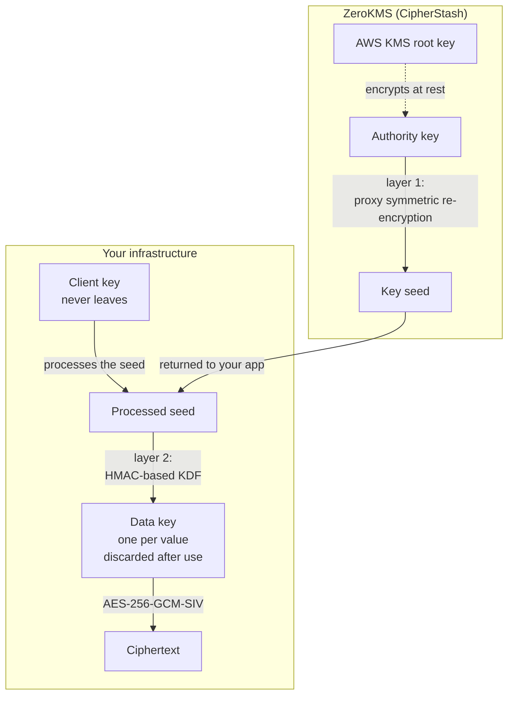

This page is the single reference for CipherStash's cryptographic design. Every other page that touches key management links here rather than restating it.

## Cryptographic primitives

| Purpose | Algorithm | Details |
|---|---|---|
| Data encryption | AES-256-GCM-SIV | Authenticated encryption with nonce-misuse resistance |
| Equality search terms | HMAC-SHA-256 | Deterministic terms for exact-match lookups |
| Range and sorting terms | Block ORE | Order-revealing encryption ([Lewi-Wu 2016](https://eprint.iacr.org/2016/612)), with enhancements from [Bogatov et al. 2018](https://arxiv.org/abs/1810.05135) |
| Free-text search terms | Encrypted Bloom filters | Trigram tokenization ([Nojima/Kadobayashi 2009](https://link.springer.com/chapter/10.1007/978-3-642-04474-8_17), [Chum/Zhang 2017](https://link.springer.com/chapter/10.1007/978-3-319-66399-9_15)) |
| Payload integrity | BLAKE3 | Structure validation of the encrypted payload |
| Payload encoding | MessagePack + Base85 | Compact binary serialization, stored as `jsonb` in PostgreSQL |

Encryption and decryption happen in your application process, in the native Rust module. CipherStash infrastructure never sees plaintext.

## The key hierarchy

Three distinct things are often all called "the key". Keeping them apart is what makes the rest of this page readable.

| Key | Where it lives | What protects it |
|---|---|---|
| **Authority key** | ZeroKMS, server-side | Encrypted at rest under an AWS KMS root key |
| **Client key** | Your application or workload | You do (`CS_CLIENT_KEY`) |
| **Data key** | Your application's memory, briefly | Nothing. It is derived per value and discarded |

The authority key and the client key are two halves of a split. Neither alone derives a data key, and the two are never brought together in one place. The key seed travels from ZeroKMS to you. The client key never travels at all.

## How a data key is produced

The mechanism operates at two layers, and descriptions that name only one of them are incomplete.

### Layer 1: the key seed, produced server-side

ZeroKMS uses **proxy symmetric re-encryption** (patent pending) on the authority key to produce a **key seed**, and returns it to your application.

ZeroKMS does this without the client key. It never receives it, and the request carries no key material of yours. That is what makes the architecture zero-knowledge: ZeroKMS produces a seed it cannot itself turn into a data key.

### Layer 2: the data key, derived client-side

Your application **processes the key seed with the client key**, then expands the result into a **unique data key per value** using an **HMAC-based key derivation function**. The data key encrypts the value with AES-256-GCM-SIV, then is discarded from memory.

The client key never leaves your infrastructure, and neither does anything it processes. Only the seed crosses the boundary, and it crosses inward.

Re-encryption describes how the seed is produced. HMAC key derivation describes how the processed seed becomes per-value keys. Both are true, at different layers.

Note which way the boundary is crossed. The key seed travels inward, from ZeroKMS to you. Nothing travels outward: not the client key, not the processed seed, not the data key.

## What is cached, and what is not

<Callout type="info">
This distinction matters for a security review, and earlier documentation stated it too broadly. "Nothing is cached" is not accurate. What is true is that **no data key is ever cached, stored, or transmitted.**
</Callout>

| Thing | Cached? | Detail |
|---|---|---|
| Data keys | Never | Derived per value, held in memory for the duration of one operation, then discarded |
| Key seeds | Not persisted | Held only for the operation that requested them |
| Keyset-scoped ciphers | **Yes, in Proxy** | [CipherStash Proxy](/reference/proxy/configuration) caches keyset-scoped cipher objects so it does not re-initialize per statement |
| Authority keys | At rest, in ZeroKMS | Encrypted under an AWS KMS root key |

Proxy's cipher cache is bounded by `cipher_cache_size` (64 entries) and `cipher_cache_ttl_seconds` (3600 seconds), and its hit rate is exposed as `cipherstash_proxy_keyset_cipher_cache_hits_total`. Caching a keyset-scoped cipher is not the same as caching a data key: the cipher still requires the client key to derive anything, and per-value keys are still derived per value.

The Stack SDK derives per operation and caches nothing.

## Trust model

An attacker must compromise **both** the ZeroKMS authority key and your client key to derive data keys. Compromising either alone is insufficient.

- CipherStash never sees plaintext. Encryption and decryption run in your process.
- CipherStash never sees your client key, nor anything the client key has processed.
- CipherStash never sees a data key. Data keys are derived in your memory.
- Ciphertext never has to leave your infrastructure. ZeroKMS handles key material, not data.

### Shared responsibility

| You | CipherStash |
|---|---|
| Protect the client key (`CS_CLIENT_KEY`) | Protect authority keys, encrypted at rest under AWS KMS |
| Secure your application and database | Operate ZeroKMS with high availability |
| Manage access keys and keysets | Enforce access-control policy on keysets |
| Register identity providers for lock contexts | Operate the CipherStash Token Service (CTS) |
| Store encrypted data in your database | Never store, access, or log plaintext |

### Blast radius

[Keysets](/stack/cipherstash/kms/keysets) scope keys. Each keyset is a full cryptographic boundary: one tenant's keyset cannot decrypt another's data. Compromising a client key affects only the keysets that application can reach, and revoking its access key stops further key derivation immediately.

## Data flow

### Write path

1. The application calls `client.encrypt(plaintext, { column, table })`.
2. The SDK requests a key seed from ZeroKMS over TLS. The request carries no key material.
3. ZeroKMS re-encrypts under the authority key and returns a key seed.
4. The SDK processes the seed with the client key, then derives a unique data key from the result, locally.
5. The SDK encrypts the plaintext with AES-256-GCM-SIV.
6. If the column declares searchable capability, the SDK generates the index terms (HMAC, ORE, Bloom filter).
7. The SDK packs ciphertext and index terms into an [EQL payload](/reference/eql/core-concepts).
8. The data key is discarded.
9. The application stores the payload in PostgreSQL.

### Read path

1. The application reads the payload and calls `client.decrypt(...)`.
2. The SDK requests a key seed, processes it with the client key, and derives the data key locally.
3. The SDK decrypts the ciphertext, discards the data key, and returns plaintext.

### Query path

1. The application encrypts a search term.
2. The SDK generates the appropriate index term (HMAC for equality, ORE for range and ordering, Bloom filter for free text).
3. PostgreSQL compares encrypted terms using [EQL](/reference/eql) operators. The database never sees plaintext.

## What querying encrypted data reveals

Searchable encryption is a trade. Each index term reveals bounded information to whoever can read the database: HMAC terms reveal equality and therefore frequency, ORE terms reveal relative order, and Bloom filter terms reveal probabilistic token membership.

That leakage model is documented once, in [Searchable encryption](/concepts/searchable-encryption), with per-term detail and guidance on when the trade is not worth making. Assess it as part of your threat model. If the ordering or frequency of a column's values is itself sensitive, encrypt that column without a searchable index and filter after decryption.

## Network security

All communication between the SDK and CipherStash services uses TLS 1.2 or later:

- SDK to ZeroKMS, for key seeds.
- SDK to CTS, for token exchange during identity-aware encryption.
- SDK to your database: your existing connection. CipherStash does not proxy it.

Key material does not leave the region your workspace is configured in. See [regions](/stack/cipherstash/kms/regions).

## Open-source components

| Component | Repository |
|---|---|
| EQL | [cipherstash/encrypt-query-language](https://github.com/cipherstash/encrypt-query-language) |
| ORE implementation | [cipherstash/ore.rs](https://github.com/cipherstash/ore.rs) |
| CipherStash Proxy | [cipherstash/proxy](https://github.com/cipherstash/proxy) |

The core cryptographic implementations are open source and independently auditable. ZeroKMS is a managed service operated by CipherStash.

## Related

- [Searchable encryption](/concepts/searchable-encryption) for the canonical index-term leakage model.
- [Keysets](/stack/cipherstash/kms/keysets) for the isolation boundary.
- [Proxy configuration](/reference/proxy/configuration) for the cipher cache settings.
- [Provable access control](/solutions/provable-access) for binding decryption to an authenticated identity.
