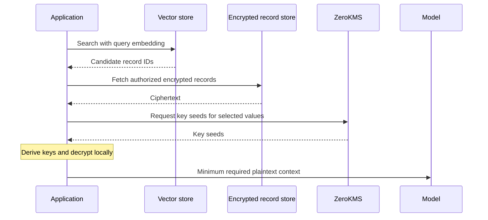

Retrieval-augmented generation pipelines often store document chunks,
customer metadata, access labels, and vector embeddings in the same database.
The source text may contain PII, financial records, health information, or
confidential business material that should not become plaintext merely because
an application needs semantic retrieval.

CipherStash encrypts sensitive fields in the application before they reach the
database. The vector store can continue retrieving candidate rows while the
application decrypts only the records selected for the prompt.

## What to encrypt

Treat each part of the RAG record according to how it is used:

| Field | Typical treatment |
| --- | --- |
| Source chunk | Encrypt; decrypt only after retrieval and authorization |
| Document title or filename | Encrypt if it contains customer or case information |
| Tenant, owner, or policy ID | Encrypt with equality when the database must filter on it |
| Access labels | Encrypt with the narrowest query capability the filter needs |
| Embedding | Keep separate from source text; assess whether the embedding itself is sensitive |

Embeddings are derived data, not ciphertext. They may reveal properties of the
source and should be covered by the application's data classification and
threat model. Encrypting the source text does not make an exposed embedding
harmless.

## Retrieval flow

The database and vector service do not receive the source plaintext. The model
still receives whichever context the application sends, so model-provider
retention, logging, prompt injection, and authorization remain separate design
decisions.

## Tenant and user isolation

Use a separate [keyset](/concepts/key-management#keysets-define-the-isolation-boundary)
when tenants or environments require a cryptographic boundary. Use
[identity-bound encryption](/solutions/provable-access) when decryption should
require claims from the signed-in user.

Apply authorization before decryption and again before assembling the prompt.
Vector similarity alone is not an authorization decision: a candidate from
another tenant must be discarded before its ciphertext is decrypted.

## Searchable metadata

If the metadata lives in Postgres, EQL can filter equality, ranges, token
matches, and JSON containment without decrypting every row. Declare only the
capabilities the retrieval pipeline uses; each capability has a documented
leakage profile. See [searchable encryption](/concepts/searchable-encryption)
and [EQL filtering](/reference/eql/filtering).

For implementation, begin with the [Stack SDK](/reference/stack), then follow
the [Data migration](/guides/migration) rollout when existing records must be
encrypted without downtime.
